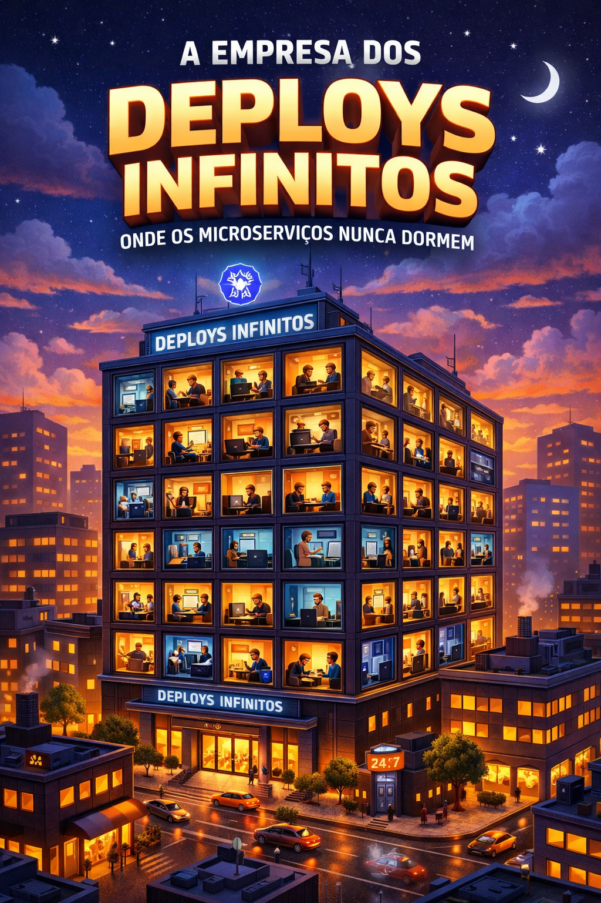

# 📖 Criando um Ebook com IAs

## 🎯 Objetivo do projeto

Criar um ebook utilizando tecnologias de IAs para explicar conceitos chaves do Kubernetes para Devs.

## 💻 Tecnologias utilizadas

- [Microsoft Copilot Chat]
- [Carbon]

## 📄 Resultado Final do Projeto

- 📥 **Download do Ebook em PDF:** [Clique aqui para baixar o ebook](./ebook-A-Empresa-Dos-Deploys-Infinitos.pdf)
- 📊 **Download do Ebook editável pelo PowerPoint:** [Clique aqui para baixar o arquivo do PowerPoint](./ebook-A-Empresa-Dos-Deploys-Infinitos.pptx)
- 🌐 **Publicação no LinkedIn** (aproveite para reagir, comentar e conectar): [TODO]()

---

## 🛠️ Construção

### 1️⃣ Criando um título épico utilizando IA

O primeiro passo foi criar um título para o ebook. Após prompts com o chat Microsoft Copilot, o título criado foi: 
**A Empresa dos Deploys Infinitos: Onde os Microserviços Nunca Dormem**

### 2️⃣ Arte para a capa

Após escolher um título para o ebook, a próxima etapa é criar uma arte para a capa. Aqui utilizei também o chat do Microsoft Copilot para gerar.

### 3️⃣ Montar a capa

Com a imagem para a capa, a próxima etapa é criar a capa do ebook em si, para isso pode-se utilizar ferramentas como Microsoft PowerPoint, LibreOffice Impress, Google Slides ou até o Canva (mesmo que não é otimizado para documentos). 

Como possuo o PowerPoint eu escolhi essa ferramenta.

### 4️⃣ Montar o layout do conteúdo

Depois de montar a capa o próximo passo foi definir o layout do conteúdo para padronizar. Foram montados 2 layouts: 1 de capa para cada seção/capítulo para separar o conteúdo e outro para o conteúdo em si.

### 5️⃣ Prompt para o conteúdo

Após ter os layouts o próximo passo foi criar o conteúdo, para isso utilizei novamente o Microsoft Copilot para gerar o conteúdo de base com o prompt abaixo.

Capítulo 1: Bem-vindo à Empresa dos Deploys Infinitos
Subtítulo: O CEO dos Containers e o RH dos Pods
Imagine o Kubernetes como uma empresa gigantesca, moderna e automatizada. Ele é o CEO que garante que todos os departamentos (workloads) funcionem sem falhas e que cada colaborador (pod) saiba exatamente o que fazer.
Em vez de pessoas, essa empresa é formada por containers, pequenas unidades de trabalho que executam partes específicas de um sistema. O Kubernetes é o sistema de gestão que organiza tudo — ele contrata, distribui tarefas, monitora desempenho e até demite (deleta pods) quando necessário.

Exemplo ilustrativo:  
Pense em um prédio corporativo com centenas de janelas. Cada janela é um container, e dentro dela há um funcionário (pod) executando uma tarefa específica. O Kubernetes garante que todas as luzes estejam acesas e que ninguém pare de trabalhar.

Capítulo 2: O Que é Kubernetes, Afinal?
Subtítulo: O Diretor de Operações da Infraestrutura
O Kubernetes é uma plataforma de orquestração de containers — ele automatiza o deploy, o escalonamento e a gestão de aplicações em ambientes distribuídos.
Criado pelo Google e mantido pela Cloud Native Computing Foundation (CNCF), ele é como o diretor de operações de uma empresa que coordena todos os times sem precisar estar em cada sala.

Conceito-chave:

Container: é o funcionário especializado, com tudo o que precisa para trabalhar (código, dependências, ambiente).

Pod: é o grupo de containers que trabalham juntos em uma mesma tarefa.

Cluster: é o prédio inteiro da empresa, com todos os departamentos e equipes.

Node: é o andar do prédio — cada node hospeda vários pods.

Exemplo ilustrativo:  
Um cluster Kubernetes é como um campus corporativo com vários prédios (nodes). Cada prédio abriga times (pods) que executam projetos (workloads). O Kubernetes supervisiona tudo, garantindo que os recursos sejam bem distribuídos.

Capítulo 3: Os Departamentos e Seus Funcionários
Subtítulo: Workloads, Pods e a Cultura da Escalabilidade
Na empresa Kubernetes, os workloads são os departamentos — cada um com sua função: marketing, vendas, TI, suporte.
Os pods são os colaboradores desses departamentos, e os containers são suas ferramentas de trabalho.

O Kubernetes distribui os pods conforme a demanda. Se o departamento de vendas (workload) precisa de mais gente, o Kubernetes contrata novos pods automaticamente. Se o movimento cai, ele reduz o time.
Essa escalabilidade automática é o que torna o Kubernetes tão poderoso.

Exemplo ilustrativo:  
Imagine o departamento de atendimento ao cliente. Durante o dia, há 100 pods trabalhando; à noite, apenas 10. O Kubernetes ajusta isso sem que ninguém precise pedir.

Capítulo 4: Quando Usar (e Quando Não Usar) Kubernetes
Subtítulo: O Custo da Eficiência e o Preço da Complexidade
O Kubernetes é incrível, mas nem toda empresa precisa de um CEO tão sofisticado.
Use Kubernetes quando:

Você tem muitos microsserviços e precisa de alta disponibilidade.

Seu sistema precisa escalar automaticamente.

Você quer portabilidade entre nuvens e ambientes.

Evite Kubernetes quando:

Seu projeto é pequeno ou monolítico.

Você não tem equipe para gerenciar a complexidade.

O custo de infraestrutura supera o ganho de automação.

Exemplo ilustrativo:  
Se sua “empresa” tem apenas um funcionário e um cliente, contratar o Kubernetes é como montar um prédio inteiro para uma mesa e um notebook.

Capítulo 5: O Dia a Dia na Empresa dos Deploys Infinitos
Subtítulo: Como os Pods Trabalham Sem Parar
O Kubernetes mantém tudo funcionando 24/7.
Ele monitora os pods, reinicia os que falham, distribui tarefas e garante que cada serviço esteja disponível.
É como um gerente de operações que nunca dorme — literalmente.

Exemplo ilustrativo:  
Um pod falhou? O Kubernetes cria outro imediatamente. Um node ficou sobrecarregado? Ele redistribui os pods para outros nodes.
Essa automação é o coração da “empresa dos deploys infinitos”.

Capítulo 6: Kubernetes nos Provedores de Nuvem
Subtítulo: Filiais Globais da Empresa dos Deploys Infinitos
O Kubernetes tem filiais nas maiores “multinacionais da nuvem”. Cada uma oferece seu próprio serviço gerenciado:

Azure Kubernetes Service (AKS):  
A filial da Microsoft. Foca em integração com o ecossistema Azure, CI/CD com GitHub Actions e monitoramento via Azure Monitor.

Amazon Elastic Kubernetes Service (EKS):  
A filial da AWS. Oferece alta escalabilidade e integração com serviços como EC2, IAM e CloudWatch.

Google Kubernetes Engine (GKE):  
A matriz original. É o ambiente mais otimizado para Kubernetes, com autoscaling inteligente e integração nativa com o Google Cloud.

Exemplo ilustrativo:  
Pense nessas nuvens como franquias da mesma empresa global. Cada uma tem seu estilo de gestão, mas todas seguem o mesmo manual de operação: o Kubernetes.

Conclusão:  
O Kubernetes é mais do que uma tecnologia — é uma cultura de organização, automação e escalabilidade.
Na “Empresa dos Deploys Infinitos”, cada pod é um colaborador dedicado, cada workload é um departamento eficiente, e o Kubernetes é o CEO que garante que tudo funcione sem parar.

### 6️⃣ Revisão e inclusão do conteúdo

Após a elaboração do conteúdo sugerido, foi realizada uma revisão detalhada. Aproveitando essa etapa, foi criado o projeto de exemplo [didifive/ebook-com-ia-apache-camel-example], implementando o código apresentado no ebook. Isso permitiu validar, revisar e testar funcionalmente o funcionamento do código, além de incluir testes unitários, estes últimos não foram abordados no ebook, pois estavam fora do escopo do documento.

### 7️⃣ Montagem do ebook
Com o conteúdo revisado e validado, o próximo passo foi montar o ebook no PowerPoint. Para isso, foram utilizados os layouts criados anteriormente, garantindo que cada seção do ebook tivesse uma apresentação visual consistente e atraente.

### 8️⃣ Exportação do ebook
Após a montagem do ebook no PowerPoint, o último passo foi exportar o arquivo para PDF. O PowerPoint permite essa funcionalidade de forma simples, garantindo que o layout e o conteúdo sejam preservados.

---

Criado com paixão, dedicação e o compromisso sincero de compartilhar conhecimento 🧑‍💻❤️🤝📚

[Microsoft Copilot Chat]: https://copilot.microsoft.com/